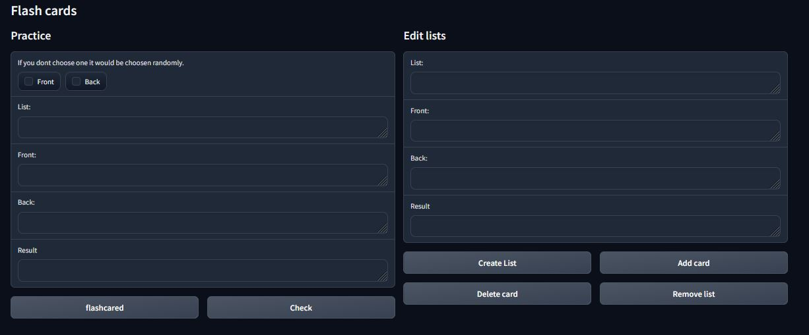

# Flash cards

## How to use

To create a new list just write the name in the right column and click "Create list". after that you can add or delete flash cards. If you want to delete a list you can do it by writing the name and then click "remove list".
After your new list is complete you can start practicing by clicking flashcard to generate a card. You can use the checkbox to choose if you want to practice the front or the back of the card. By clicking "Check" you can check your answer.
